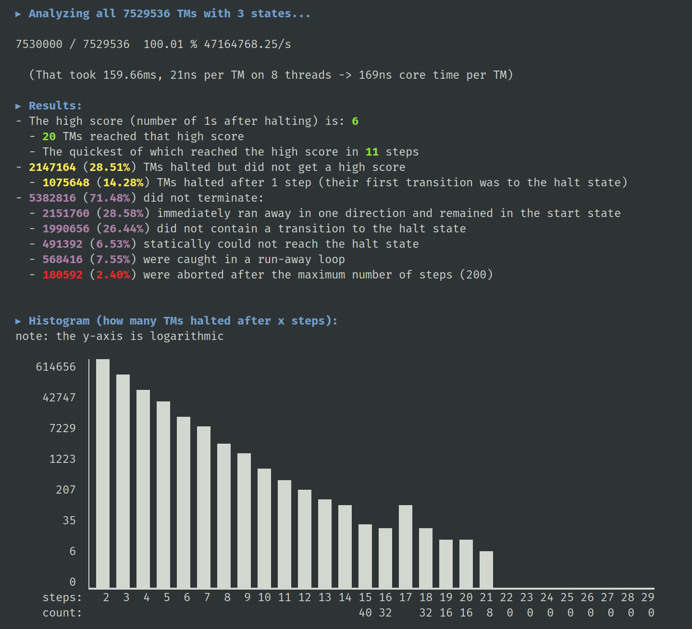

Busy Beaver
===========

An application that analyses/simulates all possible N-state Turing machines with tape alphabet = {0, 1}, where `N` is given as command line argument.
All TMs are generated, then categorized based on static analysis or their runtime behavior.
Finally a summary of all results is printed.
This is related to the [Busy Beaver game](https://en.wikipedia.org/wiki/Busy_Beaver_game).

**Features**:
- Nice output, including histogram
- Fairly fast (on a Ryzen 3600, N=4 with its 11 billion TMs runs in ≈1m55s)
- Static analysis: state graph reachability check
- Can detect and categorize ≈97% of non-halting TMs (for N=4)

    </img>

**Potential goals for future development**
- [ ] Optimize
- [ ] More smart analysis techniques
- [ ] Print states of certain TMs (e.g. the winning one)
- [ ] Show trace of the winning TM

Note that this is just a hobby project which I don't expect to be useful to anyone.
If you are still interested, PRs are always welcome.

---

## License

Licensed under either of

 * Apache License, Version 2.0, ([LICENSE-APACHE](LICENSE-APACHE) or http://www.apache.org/licenses/LICENSE-2.0)
 * MIT license ([LICENSE-MIT](LICENSE-MIT) or http://opensource.org/licenses/MIT)

at your option.

### Contribution

Unless you explicitly state otherwise, any contribution intentionally submitted
for inclusion in the work by you, as defined in the Apache-2.0 license, shall
be dual licensed as above, without any additional terms or conditions.
